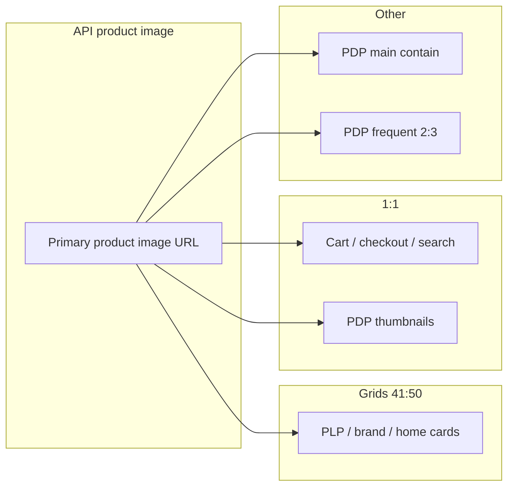

# Image placement and aspect ratios (by section)

This document describes where images appear in the Rang web app, grouped by section, with aspect ratios enforced by CSS (or explicit dimensions). **Aspect ratio** is **width : height** unless noted. Where the UI uses `object-fit: cover`, cropping follows the container; `contain` shows the full image with possible letterboxing.

---

## 1. Product catalog (same asset everywhere)

These are the **main product images** returned by the API (e.g. listing cards, PDP, cart). One upload should be chosen to look good in the **dominant** slot (grid cards); other slots are smaller or crop.

| Where | Ratio / behavior | Source |
|--------|------------------|--------|
| **Category / tag / campaign / brand product grids** | Container `aspect-ratio: 0.82` → **41 : 50** (portrait) | [app/assets/css/products.css](app/assets/css/products.css) (`.product-img`), also [app/assets/css/product.css](app/assets/css/product.css), brand/collection pages |
| **Home “product-style” blocks** (e.g. grids using `0.82`) | **41 : 50** | Same pattern in [components/ExploreRang.vue](components/ExploreRang.vue) + [ExploreRang.css](components/ExploreRang.css) |
| **PDP main image** | **No fixed ratio** — max height ~677px, full width, `object-fit: contain` | [app/assets/css/product.css](app/assets/css/product.css) (`.product-image-section img`) |
| **PDP thumbnails** | **1 : 1** | `.thumbnail-item img` in `product.css` |
| **PDP “Frequently bought together”** | **2 : 3** | `.frequently-bought-image` in `product.css` |
| **PDP related products** | **41 : 50** (`0.82`) | `.related-products .product-img` in `product.css` |
| **Cart line items** | **1 : 1** (120×120 box, cover) | [app/pages/cart/index.vue](app/pages/cart/index.vue) + cart CSS |
| **Checkout line items** | **1 : 1** (80×80 box, cover) | Checkout page styles |
| **Search dropdown results** | **1 : 1** (50×50) | [components/AppHeader.vue](components/AppHeader.vue) |
| **Wishlist** | Fixed **height 300px**, full width, `cover` — effective ratio **varies with viewport width** | [app/pages/wishlist/index.vue](app/pages/wishlist/index.vue) |
| **Profile wishlist** | Fixed **h-48** (12rem height), full width — **ratio varies** | [app/pages/profile/index.vue](app/pages/profile/index.vue) |
| **Order invoice line items** | **80 : 98** (≈ **40 : 49**, close to 41:50) | [app/pages/orders/[orderId]/index.vue](app/pages/orders/[orderId]/index.vue) (`width="80"` `height="98"`) |

**Practical guidance for product photography:** Optimize for **~41 : 50** portrait for grids; thumbnails and cart need a **square-safe center crop** (or dedicated square asset if the CMS supports multiple images).

---

## 2. Home — heroes and large banners

| Section | Ratio | Source |
|---------|--------|--------|
| **Main hero (HeroBanner / HeroBanner2)** | **1920 : 800** → **12 : 5** | [components/HeroBanner.css](components/HeroBanner.css), [HeroBanner2.css](components/HeroBanner2.css) (`aspect-ratio: 1920/800`) |

---

## 3. Listing / campaign heroes (not PDP)

| Section | Ratio | Source |
|---------|--------|--------|
| **Category / tag / campaign page top hero** (`.hero-content img`) | **13 : 4** (`aspect-ratio: 3.25`) | [app/assets/css/products.css](app/assets/css/products.css) |

---

## 4. Home — modular sections (marketing tiles)

Ratios differ by block; many use Tailwind `aspect-[…]` in the Vue file plus overrides in CSS.

| Section | Ratio(s) | Source |
|---------|-----------|--------|
| **New Arrival** | **17 : 25** (`0.68`) | [components/NewArrival.css](components/NewArrival.css) |
| **Explore Rang** | Desktop: **1.73 : 1**, **1 : 1**, **41 : 50**; mobile: **2.63 : 1**, **22 : 25** (`0.88`) | [components/ExploreRang.vue](components/ExploreRang.vue), [ExploreRang.css](components/ExploreRang.css) |
| **Shop by Category** | Men main: **1 : 1**; Women main: **1.7 : 1**; secondary tiles **2 : 1** (desktop); mobile men **22 : 25**, women **1.73 : 1**, secondary **22 : 25** | [components/ShopByCategory.vue](components/ShopByCategory.vue), [ShopByCategory.css](components/ShopByCategory.css) |
| **Timeless Six Yards / Shop by Theme** | **17 : 25** and **73 : 100** (`0.73`) | [TimelessSixYards.css](components/TimelessSixYards.css), [ShopByTheme.css](components/ShopByTheme.css) |
| **Shop by Brand** | **1 : 1** for brand tiles | [ShopByBrand.vue](components/ShopByBrand.vue) |
| **Sale / Sale countdown blocks** | Mix **17 : 25** and **1 : 1** | [SaleOffer.vue](components/SaleOffer.vue), [SaleOfferCountdown.vue](components/SaleOfferCountdown.vue) |
| **Why Rang** | Wide strip **~2.22 : 1** / **2.08 : 1**; secondary **~10 : 13** (`0.77`) | [WhyRang.vue](components/WhyRang.vue), [WhyRang.css](components/WhyRang.css) |
| **Complex Grid (homepage)** | **3 : 4** (`600×800` in markup) | [components/ComplexGrid.vue](components/ComplexGrid.vue) |
| **Welcome popup** | Full-bleed `object-fit: cover` in modal — **no fixed ratio** (follow design artboard) | [components/WelcomePopup.vue](components/WelcomePopup.vue) |

**Customer Diaries** and similar may use **static** assets under `/public` — not necessarily CMS uploads; confirm in admin which fields map to which component.

---

## 5. Header / branding

| Asset | Notes |
|-------|--------|
| **Logo** | Fixed width (~100px class); height follows intrinsic image — use a **horizontal logo** with transparent PNG/SVG as designed |

---

## 6. Diagram — product image reuse

---

## 7. Caveats

- **CMS vs code:** Homepage section images are often **per-slot** in the admin API; match each slot to the ratio in the table for that component.
- **Responsive:** Some sections change ratio at breakpoints (e.g. Explore Rang, Shop by Category); provide assets per breakpoint or favor the **largest / default** desktop ratio.
- **Not exhaustive:** Any new page added after this audit should be checked for `aspect-ratio`, `NuxtImg` width/height, and fixed `width`/`height` in CSS.
